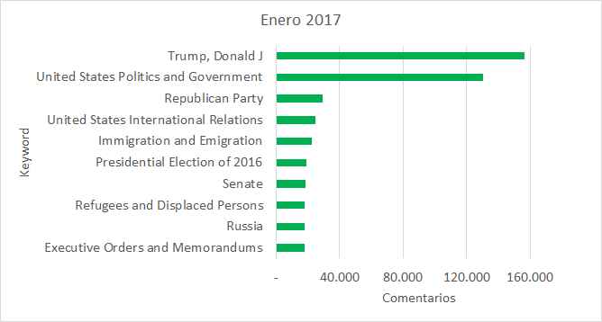

# 2019-NYT-comments
Analysis of the NYT comments in 2017. [José Berrocal, Raúl Cid, Ignacio Machuca. Grupo 5]

# Resumen
El propósito de este proyecto es realizar un análisis de artículos y comentarios del periódico New York Times durante el periodo de enero y mayo del 2017. 

Se busca contestar preguntas como cuáles fueron las keywords (tags) mas comentadas durante cada mes, la evolución de ciertas keywords durante el periodo completo, o que tan popular es Donald Trump. 
Además, se buscó la forma de asignarle un puntaje a cada comentario (sentiment analysis) con el fin de relacionar keywords con la positividad/negatividad de los comentarios.

# Data
El dataset utilizado se descargo del sitio "https://www.kaggle.com/aashita/nyt-comments/", viene separado por mes y por artículo/comentario (por ejemplo: ArticlesApril2017), y el formato utilizado para almacenar los archivos son tablas '.csv'. 

Solo se utilizó la mitad del dataset, correspondiente a los datos de 2017, y que pesa 286 MB comprimido, y 892,7 MB descomprimido. El resto de los datos fueron omitidos para simplificar el análisis y mantener los resultados cohesionados (no tener un salto de 7 meses entre unos datos y otros). Además, este periodo coincide con los primeros meses del mandato de Donald Trump.

Los datos de los artículos son pequeños en comparación a los coentarios, no contiene tantas columnas y tampoco contiene el cuerpo del articulo. De todas las columnas consideraremos los siguientes atributos: (articleID, headline, keywords). En promedio, por mes se tienen entre 800 y 1200 artículos.

Por su parte, los comentarios son bastante más extensos, ya que estos contienen el comentario completo y varios otros atributos de los que usaremos: (commentBody, commentID, articleID). En promedio, por mes se tienen entre 210.000 y 250.000 comentarios.

# Metodología

# Resultados
Se calcularon los keywords que más generaban comentarios por año, resultados que estan en <a href= 	"top10_comments.txt">top10_comments.txt</a>, en la Fig. 1 se grafic el ranking del mes de enero.

<figure>

 

<figcaption>
Fig 1.  top 10 keywords más comentadas de enero</a>
</figcaption>   
</figure>

  

 <figure>

 
<figcaption>
Fig 2.  evolución de keywords entre enero y mayo 2017</a>
</figcaption>   
</figure>

  

A continuación se muestran distintos histogramas de sentiment score para los comentarios de distintos articulos:

<figure>

 
<figcaption>
Fig 3. Distribución de puntaje<a href="https://www.nytimes.com/2017/01/06/us/politics/donald-trump-wall-hack-russia.html"> "Putin Led Scheme to Aid Trump, Report Says"</a>
</figcaption>   
</figure>

 
  

<figure>

 
<figcaption>
Fig 4. Distribución de puntaje <a href="https://www.nytimes.com/2017/01/03/us/politics/trump-house-ethics-office.html">"House G.O.P. Abandons Bid to Stifle Ethics Office"</a>
</figcaption> 
</figure>

 

<figure>

 
<figcaption>
Fig 5. Distribución de puntaje <a href="https://www.nytimes.com/2017/04/01/travel/vancouver-british-columbia-canada-unfolding-story-culture.html">"An Ever-Unfolding Story"  </a>
</figcaption>   
</figure>

 
  

<figure>

 
<figcaption>
Fig 6. Distribución de puntaje <a href="https://www.nytimes.com/2017/03/03/style/modern-love-you-may-want-to-marry-my-husband.html">"You May Want to Marry My Husband"  </a>
</figcaption>   
</figure>

   
